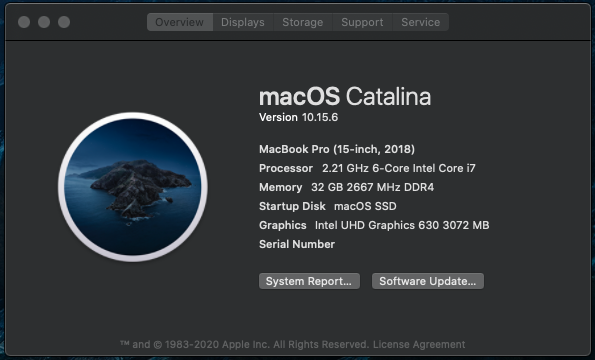
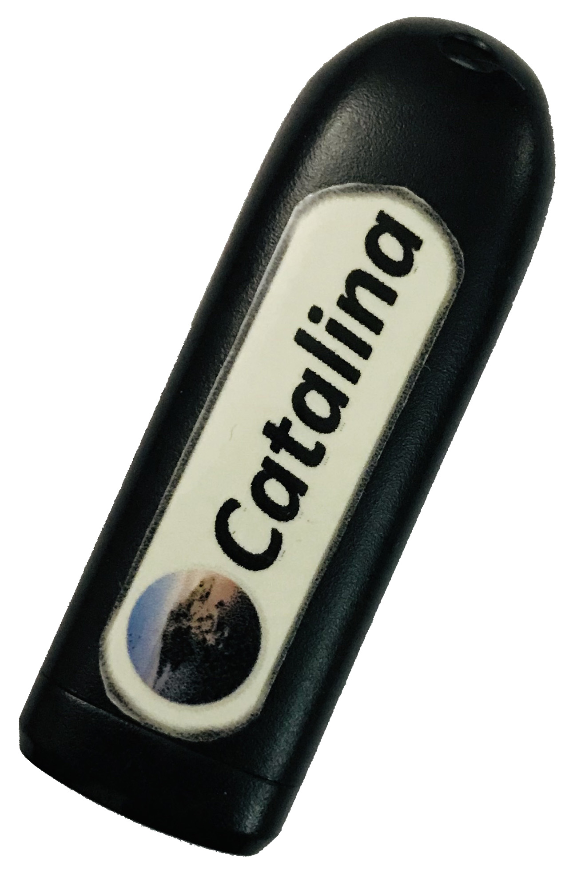

# Legion Y730 running macOS Catalina 10.15.6
<p align="justify" >
If you are a windows user and require macOS to learn XCode, then you can transform your windows machine into the Hackintosh machine. Remember, this tutorial is for educational purpose. I will be not responsible for any damage done to your device while installing macOS. Do at your own risk. This tutorial is only for Lenovo legion Y730/Y740. Back up your important files before starting. All files, that you require for macOS installation, are available in my GitHub page. This guide is in <b>chronological order</b>. So, do not miss any steps. Now let's begin.
</p>
<p align="center"></p>


## Make Bootable USB with macOS Catalina or Windows 10:
</img>
- Here I will explain the process of making a bootable USB drive. So be patience:
  - Size of the USB drive can be 16GB or more.
  - You can download the macOS.dmg file from [torrentmac.net](https://www.torrentmac.net/macos-catalina-10-15-6-19g73/), then open it through VirtualBox and copy "macOS Catalina Installer" into the "Applications" section of macOS.
  - Use USB 2.0 pen drive, to avoid error like: 🚫  sign with [dark background](https://github.com/md-siam/Hackintosh-Legion-Y730_Y740/blob/master/images/USB_Disconnected.jpg)
  - Turn on "Terminal" and copy & paste the command below:
  - ``` sudo /Applications/Install\ macOS\ Catalina.app/Contents/Resources/createinstallmedia --volume /Volumes/MyVolume ```
  - "MyVolume" - it is the name of your USB pen drive.
  - After making a USB bootable device, download "Clover Configurator" inside the VirtualBox. Mount the EFI partition, of the USB drive, using clover configurator, and replace the EFI folder with my EFI folder (unzip EFI.7z before placing it inside EFI partition).
  - Done with bootable USB device.

## BIOS Settings:
```
  ✰✰✰✰✰✰✰✰✰ First of all, upgrade your Lenovo Legion Y730 BIOS to "8XCN34WW (V2.03)" ✰✰✰✰✰✰✰✰✰✰
  ✰✰✰✰✰✰✰✰✰✰✰✰✰✰✰✰✰ Because this EFI file is only tested in that BIOS version ✰✰✰✰✰✰✰✰✰✰✰✰✰✰✰✰✰
  ✰✰✰✰✰✰✰✰✰✰✰✰✰✰ WARNING! BIOS version downgrading is NOT possible in any laptop ✰✰✰✰✰✰✰✰✰✰✰✰✰✰
  ✰✰✰✰✰✰✰✰✰✰✰✰✰✰✰✰ So, if you upgrad to a newer version then you CANNOT downgrade ✰✰✰✰✰✰✰✰✰✰✰✰✰
  ```
  
- Press F2 to get into the BIOS. Match your BIOS setting with the pictures given below:
  - Information: [Photo](https://github.com/md-siam/Hackintosh-Legion-Y730_Y740/blob/master/images/BIOS_0.jpg)
  - Configuration: [Photo](https://github.com/md-siam/Hackintosh-Legion-Y730_Y740/blob/master/images/BIOS_1.jpg)
  - Security: [Photo](https://github.com/md-siam/Hackintosh-Legion-Y730_Y740/blob/master/images/BIOS_2.jpg)
  - Boot: [Photo](https://github.com/md-siam/Hackintosh-Legion-Y730_Y740/blob/master/images/BIOS_3.jpg)
  - Exit: Save the changes and exit from BIOS [Photo](https://github.com/md-siam/Hackintosh-Legion-Y730_Y740/blob/master/images/BIOS_4.jpg)


## Intel® Virtualization Technology (Intel® VT)
Many applications use Intel Virtualization Technology to work properly, examples like:
- Android Emulator
- iPhone Simulator
- XAMPP
- Virtual Machine
- VMWare
- etc..

So, after successful macOS installation, enabled "Intel Virtual Technology" from BIOS, and those apps will work properly.


## Special Thanks To:
 - [tonymacx86](https://www.tonymacx86.com) for Clover
 - [torrentmac.net](www.torrentmac.net) for full macOS Catalina DMG file [sharing](https://www.torrentmac.net/macos-catalina-10-15-6-19g73/)
 - [xiaoMGitHub](https://github.com/xiaoMGitHub) for providing his [EFI](https://github.com/xiaoMGitHub/LEGION_Y7000Series_Hackintosh/releases/tag/v3.0.2) folder
 - [ComputerTipsLaiju](https://www.youtube.com/watch?v=57aA8e9YQSg&t=66s) for macOS installation guide
